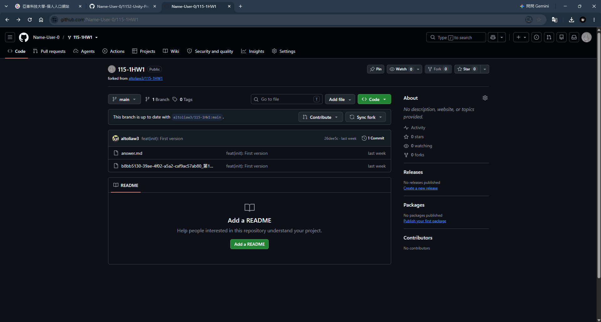
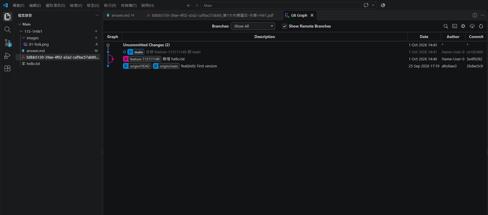

# 第1次作業題目-作業-HW1
>
>學號：113111149
><br />
>姓名：王立杰
><br />
>作業撰寫時間：130
><br />
>最後撰寫文件日期：2026/10/01
>

本份文件包含以下主題：(至少需下面兩項，若是有多者可以自行新增)
- [x] 說明內容
- [x] 其他 (可以包含心得或是想跟老師反映)

## 說明內容

以下介紹幾種常見的 Markdown 語法。Markdown 使用簡單的純文字符號標記文件結構，方便撰寫標題、清單、連結與程式碼，也能直接在 GitHub 等平台顯示格式化內容。

1. 

Ans:
我在老師的 GitHub 倉庫頁面按下 Fork，將倉庫建立在自己的帳號下。完成後，頁面顯示倉庫位於 `Name-User-0/115-1HW1`，並標示 `forked from altoliaw3/115-1HW1`，確認 fork 成功。




2. 

Ans:
Markdown 常見語法與用途如下：

- 標題：在文字前加上 `#`，數量代表標題層級，例如 `# 主標題`、`## 次標題`。
- 粗體與斜體：使用 `**文字**` 表示粗體，使用 `*文字*` 表示斜體。
- 清單：使用 `- 項目` 建立無序清單，使用 `1. 項目` 建立有序清單。
- 連結與圖片：使用 `[連結文字](網址)` 建立連結；使用 `` 插入圖片。
- 行內程式碼與程式碼區塊：用反引號標示行內程式碼；程式碼區塊則在程式碼前後使用三個反引號，並可在開頭標示語言，讓程式碼以適當格式呈現。
- 引用與分隔線：在文字前加 `>` 建立引用；使用 `---` 插入分隔線。
- 任務清單：使用 `- [ ] 項目` 表示未完成，使用 `- [x] 項目` 表示已完成。

以下是 Markdown 原始文字範例：

```markdown
# 遊戲設計筆記

我正在學習 **Git** 與 *Markdown*。

- 設計角色
- 撰寫遊戲規則

[GitHub](https://github.com)

`git status` 可以查看檔案狀態。

- [x] 建立專案
- [ ] 撰寫文件
```

程式碼區塊也可以標示程式語言，例如：

```python
print("Hello, Markdown!")
```

上述範例展示標題、粗體、斜體、清單、超連結、行內程式碼、任務清單及程式碼區塊等常用格式。

3. 

Ans:
我從 `main` 建立 `feature-113111149` 分支，新增 `hello.txt`，寫入指定日期時間、`Hello Git!`、姓名及學號，並提交為「新增 hello.txt」。接著切回 `main`，將功能分支合併回主分支。Git graph 可看到新增檔案的提交及合併提交。



合併完成後，我已將 `main` 推送至自己的 GitHub 倉庫，並確認遠端 `main` 已更新至合併提交。


4. 

Ans:
我在作業提供的名單中找到自己的資料列，並將 GitHub 個人 Profile 網址 `https://github.com/Name-User-0` 填入對應欄位。下圖是填寫完成後的結果。


## 其他

透過這次作業，我練習了 Fork、建立分支、提交變更、合併回 `main` 並推送到 GitHub，也熟悉了 Markdown 的基本格式。過程中遇到 Git 無法啟動提交訊息編輯器的問題，改用 `git commit -m` 後順利完成提交；這讓我更了解如何在終端機中明確提供提交訊息。